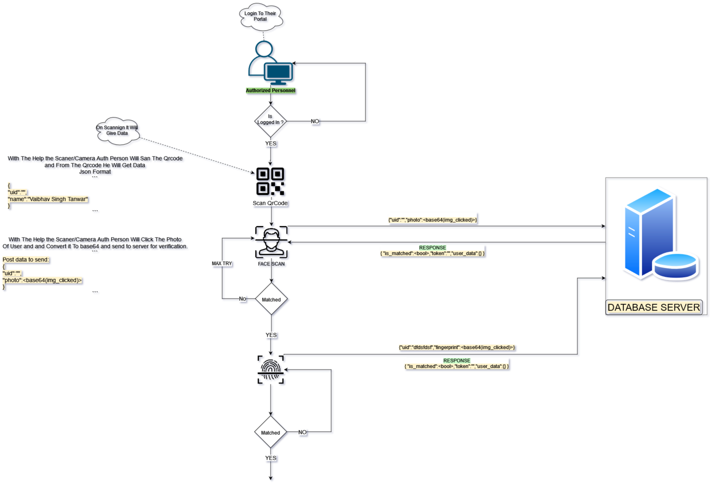

# Accessing User Data Flow Documentation

## Introduction

This document outlines the step-by-step process for Authorized Personnel to access user data in the AI-based Unique Identification Card System (UICS), with a maximum of three attempts to match the face and OTP Verification.

## Flow Overview

1. **User Authentication:**
   - **Step 1:** First, Authorized Personnel log in to their portal using their unique username and password credentials.

2. **QR Code Scanning:**
   - **Step 2:** After logging in, Authorized Personnel can scan a QR code from a user's UICS.
   - **Step 3:** The scanned QR code provides basic user data in JSON format, including the user's name and their Unique 16-Digit Card Number.
   - ``` Json
     // Data Which Is Basically Stored In QrCode   
        {
            "card_number": "1234-5678-9012-3456", // 16-digit card number,
            "name":"Vaibhav Singh Tanwar"
        }
     ```

3. **Face Recognition:**
   - **Step 4:** Authorized Personnel initiate face recognition by scanning the face of the user.
   - **Step 5:** A request is sent to the server, including the user's base64-encoded facial image and the user's 16-digit card number.
     -    <details>
          <summary><i>More Info</i></summary>
          Authorized Personnel initiate face recognition by scanning the user's facial image, which is then sent as a base64-encoded data along with the user's 16-digit card number to the server. The server performs facial recognition by comparing the scanned image with the stored reference data, determining whether there is a match. A successful match grants access, while an unsuccessful match results in denial. This step enhances security by ensuring that the user's facial features are accurately verified before proceeding with the authentication process.
          </details>
    - ``` Json
      // Data Which Is Send to Server For Verification
        {
            "card_number": "1234-5678-9012-3456", // 16-digit card number,
            "face_image": "base64-encoded-image-data", // Base64-encoded
        }
      ```
   - **Decision 2:** If the server's response indicates that the facial recognition was unsuccessful and the maximum number of attempts (3) has been reached, access to the user data is denied, and the process terminates.
   -  ```json
      //Response Recived From The Serevr
            {
                "is_matched":false, //bool field
            }
        ```
   - **Step 6:** If the facial recognition is unsuccessful but fewer than three attempts have been made, repeat Step 4 to make additional attempts.
   - **Step 7:** If successful, proceed to the next step.
      -  ```json
         //Response Recived From The Serevr
            {
                "is_matched":true, //bool field
                "token1":""
            }
         ```
4. **OTP Verification:**
    - Step 8: Authorized Personnel initiate OTP verification. An OTP is sent to the user's registered email or phone number.
    - Step 9: The user receives the OTP and enters it in the portal for identity verification.
        - Decision 3: If the OTP verification is unsuccessful, access to the user data is denied, and the process terminates.
    - Step 10: If successful, proceed to the next step.
      -  ```json
         //Response Recived From The Serevr
            {
                "is_otp_matched":true, //bool field
                "token2":""
            }
         ```

5. **User Data Retrieval:**
   - **Step 12:** If both facial recognition and OTP Verification are successful, Authorized Personnel receive the requested user data in JSON format By Sending The Both Tokens That He Recived On Verification.
   -  ```json
      //Data Which Is Send to Server For Retrival Of Userdata
            {
                "token1":"",
                "token2":""
            }
        ```
   -
   -  ```json
      // If Both Tokens Are Valid Authorized Personnel Will Recive The User Data From Backend
            {
                "user_name": "Vaibhav Singh Tanwar",
                "age": 21,
                "address": "Chandigarh University (CU) in Mohali, 140413 Punjab, India.",
                // Additional user data fields
            }
        ```




## Conclusion

This document outlines the secure and step-by-step process for Authorized Personnel to access user data using the AI-based Unique Identification Card System (UICS), incorporating a maximum of three attempts for both facial recognition and OTP Verification. Access is granted only if the required authentication steps are successfully completed within the specified limit.
